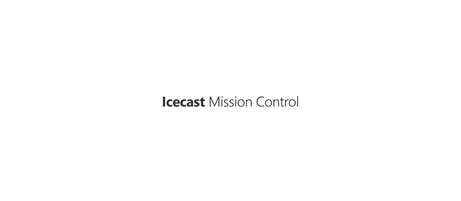
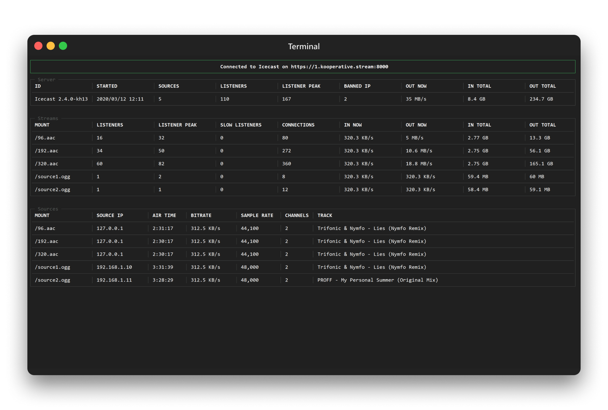

<p align="center"><a href="#readme"></a></p>

<p align="center">
  <a href="https://kaos.sh/w/imc/ci"></a>
  <a href="https://kaos.sh/w/imc/codeql"></a>
  <a href="https://kaos.sh/r/imc"></a>
  <a href="#license"></a>
</p>

<p align="center"><a href="#screenshots">Screenshots</a> • <a href="#installation">Installation</a> • <a href="#usage">Usage</a> • <a href="#ci-status">CI Status</a> • <a href="#contributing">Contributing</a> • <a href="#license">License</a></p>

<br/>

`imc` (_Icecast Mission Control_) is a simple terminal dashboard for Icecast.

### Screenshots

<p align="center"></p>

### Installation

#### From source

To build the `imc` from scratch, make sure you have a working [Go 1.23+](https://github.com/essentialkaos/.github/blob/master/GO-VERSION-SUPPORT.md) workspace (_[instructions](https://go.dev/doc/install)_), then:

```
go install github.com/essentialkaos/imc@latest
```

#### Prebuilt binaries

You can download prebuilt binaries for Linux and macOS from [EK Apps Repository](https://apps.kaos.st/imc/latest):

```bash
bash <(curl -fsSL https://apps.kaos.st/get) imc
```

### Usage

<p align="center"></p>

### CI Status

| Branch | Status |
|--------|--------|
| `master` | [](https://kaos.sh/w/imc/ci?query=branch:master) |
| `develop` | [](https://kaos.sh/w/imc/ci?query=branch:develop) |

### Contributing

Before contributing to this project please read our [Contributing Guidelines](https://github.com/essentialkaos/.github/blob/master/CONTRIBUTING.md).

### License

[Apache License, Version 2.0](https://www.apache.org/licenses/LICENSE-2.0)

<p align="center"><a href="https://kaos.dev"></a></p>
